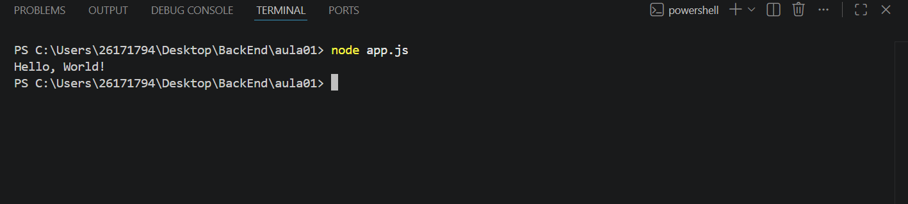

# Meu primeiro Projeto JavaScript 

## Aluno 🦍💨

Nome: Vinicius Andrade Oliveira
Turma: DS1A

---

## Sobre 

Este projeto foi desenvolvido durante a primeira aula de JavaScript.

### o objetivo foi aprender: 
- utilizar o VS Code;
- executar JavaScript com Node.js 
- utilizar o Terminal
- criar documento utilizando Markdown

---

## 🗂️ Estruturas

```
Meu primeiro PRojeto JS
|
|-app.js
|-informacoes.js
|-operadores.js
|-variavel.js
|-readme.md
|-imagem/

```
## Comom executar

```bash
    node app.js 
```
## Código 

```javascript
    console.log("Olá, Mundo");
```

## Resultado


## Tecnologia 
- JavaScript
- Node.js
- Visual Studio Code
- Markdown

## O que eu aprendi
- Criar um arquivo Java Script.
- Executar programas.
- Utilizar terminal.
- Criar README.
- Instalar extensões.
- Utilizar Markdown.
- GIT.
- Variável.
- Operadores.

